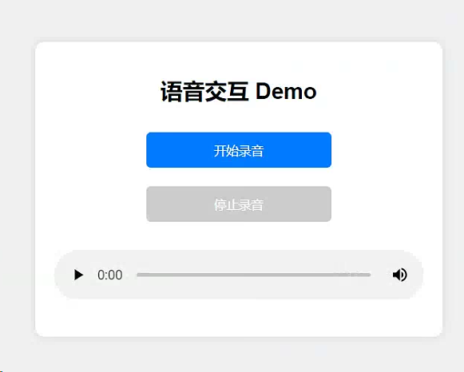

# 语音交互 Demo

这是一个简单的语音交互项目，前端通过录音将音频发送到后端，后端使用 Whisper 模型进行语音识别，并通过一个语言模型生成回复，最后使用 TTS 技术将回复转换为语音并返回给前端播放。




## 文件结构

```
project_folder/
│
├── app.py                    # Flask 应用主文件，处理音频请求
├── chat.py                   # 包含 spark_completion 函数的文件
├── voice_service.py          # 声音服务类文件，包含 Voice 抽象类和 PyttsVoice 实现类
├── requirements.txt          # 项目依赖文件
├── config.json               # 配置文件，包含敏感信息，不应提交到版本控制系统
├── .gitignore                # Git 忽略文件，包含 config.json
├── static/
│   └── index.html            # 前端 HTML 文件
└── uploads/                  # 上传的音频文件存储目录
```

## 环境配置

### 1. 克隆项目

```bash
git clone https://github.com/YYForReal/voice-interaction-demo.git
cd voice-interaction-demo
```

### 2. 创建虚拟环境并激活

```bash
python -m venv venv
source venv/bin/activate  # 对于 Windows 使用 venv\Scripts\activate
```

### 3. 安装依赖

```bash
pip install -r requirements.txt
pip install --upgrade spark_ai_python
```

### 4. 配置星火 API

在项目根目录下创建 `config.json` 文件，并添加以下内容：

```json
{
    "SPARKAI_URL": "wss://spark-api.xf-yun.com/v3.5/chat",
    "SPARKAI_APP_ID": "YOUR_SPARKAI_APP_ID",
    "SPARKAI_API_SECRET": "YOUR_SPARKAI_API_SECRET",
    "SPARKAI_API_KEY": "YOUR_SPARKAI_API_KEY",
    "SPARKAI_DOMAIN": "general"
}
```

### 5. 安装 FFmpeg

#### Windows 用户

1. 从 [ffmpeg.org](https://ffmpeg.org/download.html) 下载适合你操作系统的版本。
2. 解压下载的文件（例如，解压到 `C:\ffmpeg`）。
3. 将 `C:\ffmpeg\bin` 目录路径添加到系统环境变量中。

#### Ubuntu 用户

```bash
sudo apt-get update
sudo apt-get install ffmpeg
pip install --upgrade openai-whisper

```

### 6. 验证 FFmpeg 安装

在命令行中运行以下命令，确保 FFmpeg 已正确安装：

```bash
ffmpeg -version
```

## 运行项目

### 1. 运行后端服务器

```bash
python app.py
```

### 2. 访问前端页面

在浏览器中打开 [http://127.0.0.1:5000/static/index.html](http://127.0.0.1:5000/static/index.html)。

## 代码说明

### app.py

`app.py` 文件是 Flask 应用的主文件，处理前端发送的音频请求，使用 Whisper 模型进行语音识别，并通过语言模型生成回复，最后使用 TTS 技术将回复转换为音频并返回给前端。

### chat.py

`chat.py` 文件包含 `spark_completion` 函数，用于与语言模型交互生成回复。

### voice_service.py

`voice_service.py` 文件包含两个类：

- `Voice` 抽象类，定义了 `voiceToText` 和 `textToVoice` 两个方法。
- `PyttsVoice` 类，继承 `Voice` 类，实现了 `textToVoice` 方法，使用 `pyttsx3` 库将文本转换为语音。

### requirements.txt

`requirements.txt` 文件列出了项目所需的所有依赖项。

### static/index.html

`static/index.html` 文件是前端 HTML 文件，用户可以通过它录音并与后端进行交互。

## 注意事项

- 确保已正确安装并配置 FFmpeg。
- 在使用前，请先检查并确认所有依赖项已正确安装。

## 贡献

欢迎提出 Issue 或 Pull Request 来改进本项目。

## 许可证

本项目遵循 Apache License 2.0 许可证。
